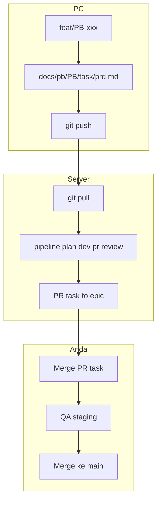

# Panduan Workflow PB — Knitto REST Backend

Dokumen ini adalah **cheat sheet** agar alur PC → Server tidak terlupa.  
Detail teknis: [`.cursor/automation/pc-workflow.md`](.cursor/automation/pc-workflow.md) · [`.cursor/automation/README.md`](.cursor/automation/README.md)

---

## Ringkasan 30 detik

| Langkah | Di mana | Apa yang dilakukan |
|---------|---------|-------------------|
| 1 | **PC** | Prompt → AI analisa → PRD terstruktur → commit → push |
| 2 | **Server** | `git pull` → jalankan pipeline |
| 3 | **GitHub** | Review & merge PR task → epic |
| 4 | **Anda** | QA epic → merge ke staging/main (manual) |

**PRD = prompt Anda → AI analisa (bisnis). Plan/API = AI buat di server (teknis).**

---

## Dokumentasi API (OpenAPI + Scalar)

- **Desain internal (PB):** tetap `api-design.md` di pipeline server — bukan pengganti OpenAPI.
- **Kontrak publish:** [`docs/openapi/openapi.yaml`](../docs/openapi/openapi.yaml) — sync **manual** saat path/body/response berubah; pakai `tags` + `x-tagGroups` selaras folder modul di `src/app/http/` (tambah tag/grup saat endpoint modul baru).
- **Aktifkan lokal:** set `OPENAPI_DOCS_ENABLED=true` di `.env`, jalankan `pnpm dev`, buka `http://localhost:{APP_PORT_HTTP}/api-docs` — sidebar Scalar (grup `x-tagGroups`).
- **Production:** biarkan `OPENAPI_DOCS_ENABLED=false` kecuali kebijakan tim mengizinkan.
- **Privasi & UI Scalar:** Agent dimatikan, `telemetry: false`, spec dari `/api-docs/openapi.yaml` (lihat [`register-open-api-docs.ts`](src/libs/config/register-open-api-docs.ts)); theme `elysia`, layout modern, `hideModels`, `withDefaultFonts: false` (tanpa CDN font Scalar), accent Knitto via `customCss` di file yang sama (favicon/logo HTTP opsional — belum dipasang). Jangan set `proxyUrl` ke proxy Scalar kecuali sengaja.
- **Lint kontrak:** setelah ubah `openapi.yaml`, jalankan `pnpm lint:openapi` (Spectral, rules di [`docs/openapi/.spectral.yaml`](docs/openapi/.spectral.yaml)).

---

## Konvensi naming

Ganti `{PB}` dan `{task}` sesuai backlog Anda.

| Item | Format | Contoh |
|------|--------|--------|
| Epic branch | `feat/{PB}` | `feat/PB-1.700.3` |
| Task branch (fitur) | `feat/{PB}-{task-slug}` | `feat/PB-1.700.3-user-history-endpoint` |
| Fix branch (bug) | `fix/{PB}-{task-slug}` | `fix/PB-1.700.2-login-timeout` |
| Path PRD | `docs/pb/{PB}/{task-slug}/prd.md` | `docs/pb/PB-1.700.3/user-history-endpoint/prd.md` |
| PR otomatis | base = epic, head = task | task → epic |

**Task slug:** huruf kecil, pemisah `-` (contoh: `user-history-endpoint`).

---

## Fase A — Di PC (Cursor IDE)

### Alur PRD (prompt → analisa → file)

```
Anda prompt ide  →  /prd (atau minta buat PRD)  →  knitto-agent-prd analisa
                                                          ↓
                                              docs/pb/{PB}/{task}/prd.md
                                                          ↓
                                    Review → commit → push epic branch
```

### Checklist

- [ ] Checkout epic branch `feat/{PB}`
- [ ] Berikan **prompt** ide fitur (bebas, belum perlu format PRD)
- [ ] Jalankan **`/prd`** + sertakan PB & task slug (atau jawab jika AI tanya)
- [ ] Review PRD terstruktur yang dibuat AI
- [ ] Commit & push

### Contoh prompt ke Cursor

```
/prd

PB: PB-1.700.3
Task: user-history-endpoint

Buat endpoint untuk melihat riwayat aktivitas user dengan pagination.
Hanya admin yang bisa akses. Data dari tabel log aktivitas yang sudah ada.
```

Tanpa `/prd`, cukup minta: *"Buat PRD untuk ... PB-1.700.3 task user-history-endpoint"* — orchestrator delegasi ke `knitto-agent-prd`.

### Perintah git (setelah PRD dibuat AI)

```bash
# 1. Epic branch (sekali per PB, atau checkout jika sudah ada)
git fetch origin
git checkout -b feat/PB-1.700.3 origin/main
# atau: git checkout feat/PB-1.700.3

# 2. PRD dibuat otomatis oleh knitto-agent-prd di:
#    docs/pb/PB-1.700.3/user-history-endpoint/prd.md
#    (folder dibuat agent jika belum ada)

# 3. Review PRD, lalu push
git add docs/pb/PB-1.700.3/user-history-endpoint/prd.md
git commit -m "docs(PB-1.700.3): PRD user-history-endpoint"
git push -u origin feat/PB-1.700.3
```

### Apa yang ditulis di PRD?

**Cukup format PRD** — jangan tulis plan/api-design manual.

| Section PRD | Isi |
|-------------|-----|
| Problem statement | Masalah bisnis |
| Scope | In / out of scope |
| Acceptance criteria | **Testable** — bisa dicek setelah dev |
| Non-goals | Batasan eksplisit |
| Open questions | Hal yang belum pasti |

Endpoint boleh disebut kasar di PRD; detail Valibot/layer/file dibuat AI di server (plan + api-design).

---

## Audit keamanan (`/security`)

Gunakan **`/security`** (atau minta audit OWASP) untuk review diff/modul sebelum merge besar atau setelah menambah guest path, query dinamis, atau integrasi external.

| Command | Subagent | Perilaku |
| ------- | -------- | -------- |
| `/security` | `knitto-agent-security` | Default: assessment readonly (finding blocker vs note) |
| User minta **perbaiki/remediasi** | `knitto-agent-security` | Fix minimal + `pnpm build` / `pnpm test` |

- **`/fix`** — bug fungsional, error runtime, test gagal (`knitto-agent-debugger`), bukan audit OWASP
- **Stage review server** — subset blocker keamanan otomatis di `review.json` (`blockers` / `notes`) via skill `security-owasp-minimal`

Playbook: [`.cursor/skills/security-owasp-minimal/SKILL.md`](.cursor/skills/security-owasp-minimal/SKILL.md) · [`.cursor/commands/security.md`](.cursor/commands/security.md)

---

## Fase B — Di Server (SSH)

### Prasyarat (setup sekali)

- [ ] Node.js **24.18.0** (`.nvmrc`), pnpm **11.17.0** (Corepack), git, `gh auth login`
- [ ] [Cursor CLI](https://cursor.com/docs/cli/using): `agent` di PATH
- [ ] `CURSOR_API_KEY` di env atau `.cursor/automation/config.env`
- [ ] Salin `config.example.env` → `config.env`, isi `GITHUB_ASSIGNEE`

```bash
curl https://cursor.com/install -fsS | bash
cp .cursor/automation/config.example.env .cursor/automation/config.env
# edit config.env: CURSOR_API_KEY, GITHUB_ASSIGNEE
```

### Checklist setiap task

- [ ] Pull epic branch (harus sudah ada PRD dari PC)
- [ ] Trigger pipeline
- [ ] Pantau log sampai selesai
- [ ] Cek PR di GitHub (assignee Anda jika review pass)

### Perintah

```bash
cd /path/to/knitto-rest-user-management-pusat

# 1. Pull PRD terbaru
git checkout feat/PB-1.700.3
git pull origin feat/PB-1.700.3

# 2. Verifikasi PRD ada
ls docs/pb/PB-1.700.3/user-history-endpoint/prd.md

# 3. Jalankan pipeline (foreground)
node .cursor/automation/run-pipeline.mjs \
  --pb PB-1.700.3 \
  --task user-history-endpoint \
  --assignee YOUR_GITHUB_USERNAME

# Atau background (bisa tutup SSH)
node .cursor/automation/run-pipeline.mjs \
  --pb PB-1.700.3 \
  --task user-history-endpoint \
  --assignee YOUR_GITHUB_USERNAME \
  --background
```

**Tidak perlu `--prompt`.** PRD dibaca otomatis dari `docs/pb/.../prd.md`.

### Pantau progress

```bash
tail -f .cursor/runs/PB-1.700.3/user-history-endpoint/pipeline.log
cat .cursor/runs/PB-1.700.3/user-history-endpoint/state.json
```

### Stage otomatis di server

```
git → plan → dev → pr → review → assign (jika pass)
```

| Stage | Output |
|-------|--------|
| git | Task branch dari epic |
| plan | `.cursor/runs/.../plan.md`, `api-design.md` |
| dev | Kode + `pnpm build` + `pnpm test` |
| pr | PR GitHub (task → epic) |
| review | `review.json`; assign jika pass |

---

## Fase C — Setelah pipeline (manual Anda)

```
PR task ──merge──► epic feat/PB-xxx
                         │
                         ▼ (QA manual)
              releases/staging atau releases/development
                         │
                         ▼ (lolos QA)
                      main
```

- [ ] Review PR task → merge ke epic `feat/PB-xxx`
- [ ] Deploy / QA di staging atau development
- [ ] Jika lolos: PR epic → `main`

**Pipeline tidak merge otomatis** ke staging/main.

---

## Bug di epic (tanpa PRD)

Untuk bug yang ditemukan **setelah fitur di epic**, gunakan **`run-fix.mjs`** — bukan `run-pipeline.mjs`.

### Alur

```
Orchestrator buat GitHub issue
  → run-fix.mjs --github-issue N
  → git → fix (debugger) → pr → review
  → (opsional) run-babysit.mjs jika komentar/CI bermasalah
```

### Checklist

- [ ] Epic branch `feat/{PB}` sudah ada dan up-to-date
- [ ] GitHub issue **OPEN** (judul + deskripsi bug)
- [ ] Trigger fix pipeline di server
- [ ] Review & merge PR fix → epic

### Perintah

```bash
# Dry-run
node .cursor/automation/run-fix.mjs \
  --pb PB-1.700.2 \
  --task login-timeout \
  --github-issue 456 \
  --dry-run

# Background
node .cursor/automation/run-fix.mjs \
  --pb PB-1.700.2 \
  --task login-timeout \
  --github-issue 456 \
  --assignee YOUR_GITHUB_USERNAME \
  --background

# Pantau
tail -f .cursor/runs/PB-1.700.2/login-timeout/fix.log
cat .cursor/runs/PB-1.700.2/login-timeout/state.json
```

**Tidak perlu PRD.** Issue di-fetch dari GitHub → disimpan ke `issue.md` di run dir.

### Resume setelah gagal

```bash
node .cursor/automation/run-fix.mjs \
  --pb PB-1.700.2 \
  --task login-timeout \
  --resume \
  --from-stage fix
```

---

## Troubleshooting

### `PRD not found: docs/pb/...`

PRD belum di-push dari PC, atau `--pb` / `--task` salah.

```bash
# Di PC: pastikan sudah push
git push origin feat/PB-1.700.3

# Di server: pull lagi
git pull origin feat/PB-1.700.3
```

### Pipeline gagal di tengah jalan

```bash
# Lanjut dari stage tertentu (setelah perbaiki masalah)
node .cursor/automation/run-pipeline.mjs \
  --pb PB-1.700.3 \
  --task user-history-endpoint \
  --assignee YOUR_GITHUB_USERNAME \
  --resume \
  --from-stage dev
```

Stage valid: `git` | `plan` | `dev` | `pr` | `review`

### Review fail

- Baca comment di PR GitHub (blockers dari AI reviewer)
- Perbaiki manual atau jalankan ulang dari `--from-stage dev`
- PR **tidak** di-assign sampai review pass

### Dry-run (cek perintah tanpa eksekusi)

```bash
node .cursor/automation/run-pipeline.mjs \
  --pb PB-1.700.3 \
  --task user-history-endpoint \
  --assignee YOUR_GITHUB_USERNAME \
  --dry-run
```

---

## Template variabel (copy-paste)

Isi sebelum mulai task baru:

```
PB ID:        PB-1.700.3
Task slug:    user-history-endpoint
Epic branch:  feat/PB-1.700.3
PRD path:     docs/pb/PB-1.700.3/user-history-endpoint/prd.md
Assignee:     _______________
```

---

## Referensi cepat

| Topik | File |
|-------|------|
| Format PRD | [`.cursor/skills/prd-author/SKILL.md`](.cursor/skills/prd-author/SKILL.md) |
| Subagent PRD (PC) | [`.cursor/agents/knitto-agent-prd.md`](.cursor/agents/knitto-agent-prd.md) |
| Config server | [`.cursor/automation/config.example.env`](.cursor/automation/config.example.env) |
| Standar kode | [`.cursor/rules/boilerplate.mdc`](.cursor/rules/boilerplate.mdc) |
| Subagent IDE (/feature, /fix, …) | [`.cursor/agents/README.md`](.cursor/agents/README.md) |
| Index PRD | [`docs/pb/README.md`](docs/pb/README.md) |

---

## Scalar API Reference lokal (OpenAPI)

Desain internal PB tetap **`api-design.md`** di pipeline server. Untuk kontrak machine-readable di repo: [`docs/openapi/openapi.yaml`](docs/openapi/openapi.yaml).

1. Set di `.env`: `OPENAPI_DOCS_ENABLED=true`
2. Jalankan `pnpm dev`
3. Buka `http://localhost:{APP_PORT_HTTP}/api-docs` — sesuaikan host/port dari `.env` (`APP_PORT_HTTP`; nilai port bisa beda per setup). Navigasi **sidebar** mengikuti `x-tagGroups` + tag modul.
4. Saat menambah/mengubah endpoint, sync `openapi.yaml` manual (checklist di skill `feature-scaffold`); `servers.url` di spec relatif (`/`) — Try it out memakai host/port halaman docs.

Default: flag `false` — `/api-docs` tidak di-mount.

---

## Diagram alur


