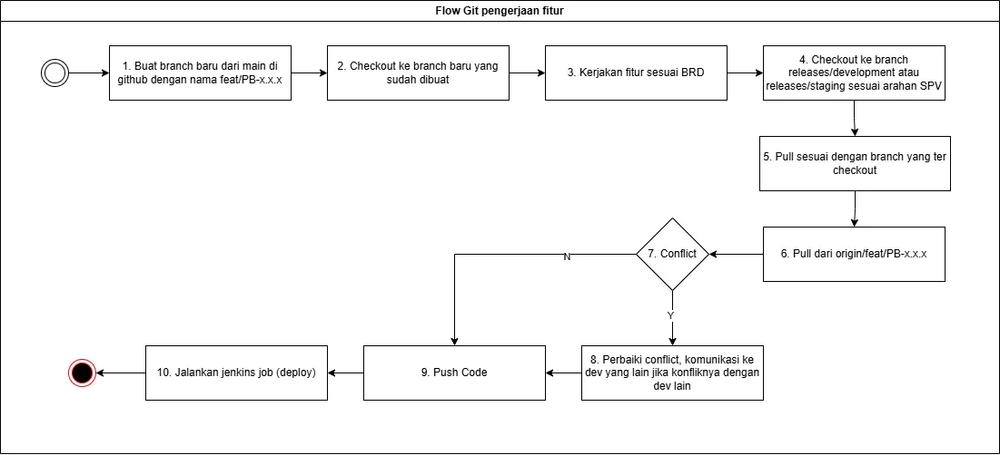
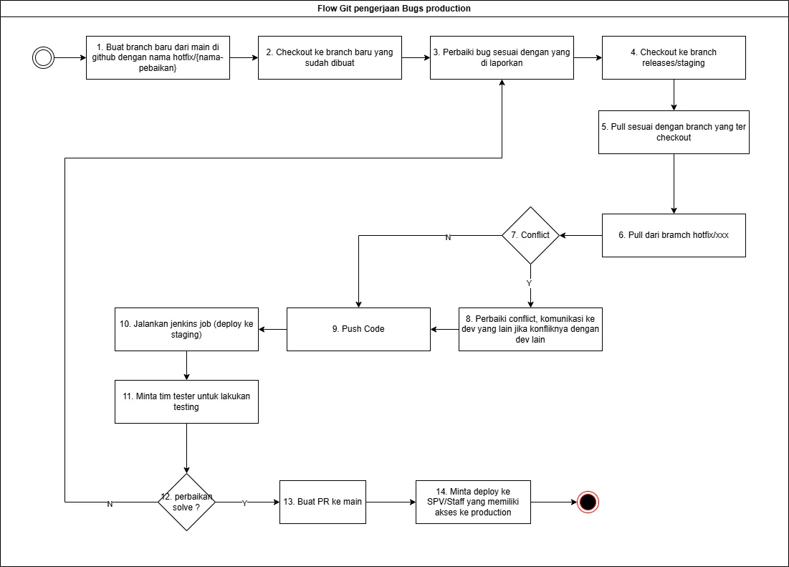
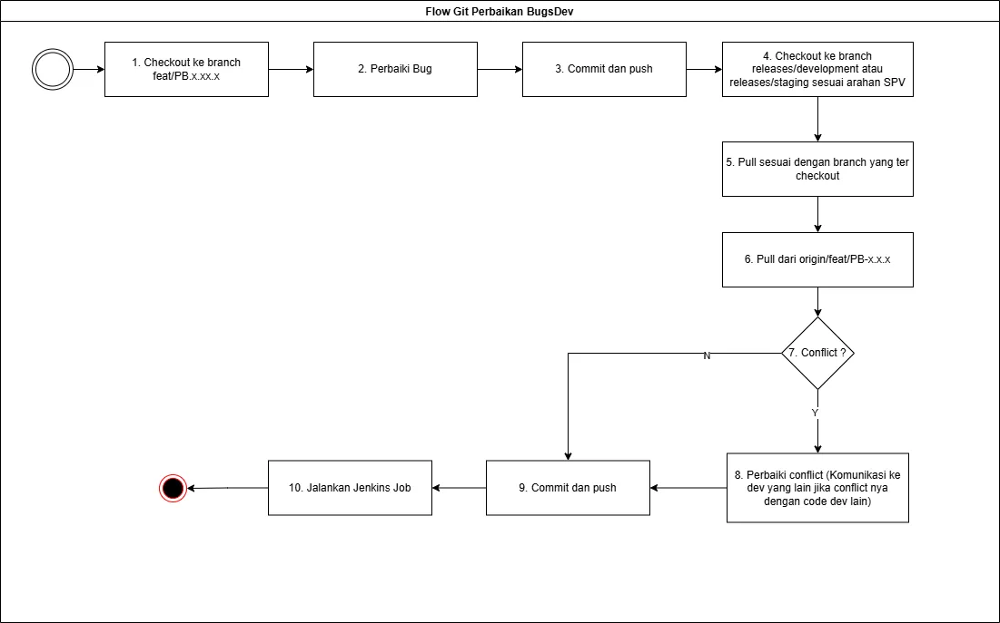
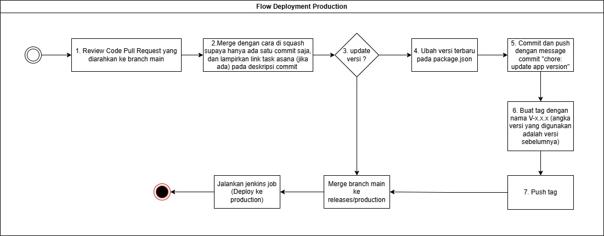

<div align="center">
	
	<h1>Knitto Backend Boilerplate</h1>
	<p><em>Production-ready TypeScript REST API Boilerplate untuk Knitto Textile</em></p>
	
  [](https://nodejs.org)
  [](https://www.typescriptlang.org/)
  [](https://pnpm.io/)
</div>

---

## 📋 Daftar Isi

- [📋 Daftar Isi](#-daftar-isi)
- [🎯 Tentang Project](#-tentang-project)
	- [Keunggulan:](#keunggulan)
- [✨ Fitur Utama](#-fitur-utama)
	- [🏗️ Architecture](#️-architecture)
	- [🔐 Security \& Validation](#-security--validation)
	- [📊 Database](#-database)
	- [🚀 Development Experience](#-development-experience)
	- [🔄 Background Processing](#-background-processing)
- [🛠️ Tech Stack](#️-tech-stack)
	- [Core Framework](#core-framework)
	- [Knitto Internal Libraries](#knitto-internal-libraries)
	- [Validation \& Schema](#validation--schema)
	- [Development Tools](#development-tools)
- [📋 Prerequisites](#-prerequisites)
- [🚀 Quick Start](#-quick-start)
	- [1. Clone Repository](#1-clone-repository)
	- [2. Setup NPM Registry untuk Knitto Packages](#2-setup-npm-registry-untuk-knitto-packages)
	- [3. Install Dependencies](#3-install-dependencies)
	- [4. Setup Environment Variables](#4-setup-environment-variables)
	- [5. Run Development Server](#5-run-development-server)
	- [6. Test API](#6-test-api)
- [📁 Struktur Project](#-struktur-project)
- [🔧 Environment Setup](#-environment-setup)
	- [Environment Variables](#environment-variables)
	- [Database Setup](#database-setup)
- [💻 Development](#-development)
	- [Development Workflow](#development-workflow)
	- [Hot Reload](#hot-reload)
	- [Debugging](#debugging)
- [🔀 Git Workflow](#-git-workflow)
	- [1. Development Fitur](#1-development-fitur)
	- [2. Perbaikan Issue Production](#2-perbaikan-issue-production)
	- [3. Development Bugs](#3-development-bugs)
	- [4. Deployment Production](#4-deployment-production)
- [🎨 Best Practices](#-best-practices)
	- [Poin Utama](#poin-utama)
- [📜 Available Scripts](#-available-scripts)
- [🤝 Contributing](#-contributing)
	- [Guidelines:](#guidelines)
	- [Code of Conduct](#code-of-conduct)
- [📚 Dokumentasi Lengkap](#-dokumentasi-lengkap)
	- [Contoh Implementasi](#contoh-implementasi)
- [💬 Support](#-support)
- [📝 Notes](#-notes)

---

## 🎯 Tentang Project

**Knitto Backend Boilerplate** adalah template project production-ready untuk membangun REST API menggunakan TypeScript dan Express.js. Boilerplate ini dirancang khusus untuk ekosistem Knitto Textile dengan best practices, struktur yang terorganisir, dan integrasi penuh dengan library internal Knitto.

### Keunggulan:

✅ **Domain-Driven Design** - Struktur terorganisir berdasarkan domain bisnis  
✅ **Type-Safe** - Full TypeScript dengan strict mode  
✅ **Auto-Routing** - Automatic route loading dengan konvensi naming  
✅ **Built-in Validation** - Request validation menggunakan Valibot  
✅ **Production Ready** - Logging, error handling, dan monitoring terintegrasi  
✅ **Developer Friendly** - Hot reload, debugging, dan comprehensive documentation

---

## ✨ Fitur Utama

### 🏗️ Architecture

- **Domain-Driven Design** - Organisasi kode berdasarkan domain bisnis
- **Layered Architecture** - Controller → Service → Repository pattern
- **Dependency Injection** - Loose coupling dan testable code

### 🔐 Security & Validation

- **Request Validation** - Schema validation dengan Valibot
- **SQL Injection Prevention** - Parameterized queries
- **Error Handling** - Exception classes dengan proper HTTP status codes
- **Transaction Support** - Database transaction management

### 📊 Database

- **MySQL Integration** - Connection pooling dengan `knitto-mysql`
- **Query Optimization** - `raw()` vs `rawQuery()` untuk performance
- **Migration Management** - Konvensi penamaan untuk tracking changes

### 🚀 Development Experience

- **Auto Route Loading** - Konvensi `*.routes.ts` dengan auto-discovery
- **Hot Reload** - Development dengan tsx watch mode
- **Type Safety** - Full TypeScript dengan strict checking
- **Comprehensive Logging** - Structured logging untuk debugging

### 🔄 Background Processing

- **Message Broker** - RabbitMQ integration
- **Background Jobs** - Timer, scheduler, event emitter
- **WebSocket Support** - Real-time communication

---

## 🛠️ Tech Stack

### Core Framework

- **Node.js** v24.18.0 LTS - JavaScript runtime
- **TypeScript** - Type-safe development
- **Express.js** - Web framework

### Knitto Internal Libraries

- **@knittotextile/knitto-http** - HTTP server & routing
- **@knittotextile/knitto-mysql** - MySQL database adapter
- **@knittotextile/knitto-core-backend** - Core utilities & error handling
- **@knittotextile/knitto-rabbitmq** - RabbitMQ integration

### Validation & Schema

- **Valibot** - Schema validation
- **TypeScript** - Compile-time type checking

### Development Tools

- **tsx** - TypeScript executor dengan hot reload
- **ESLint** - Code linting
- **Jest** - Testing framework
- **pnpm** v11.17.0 - Fast, disk space efficient package manager

---

## 📋 Prerequisites

Sebelum memulai, pastikan Anda memiliki:

- **Node.js** v24.18.0 LTS (lihat `.nvmrc` / `.node-version`)
- **pnpm** v11.17.0 (via Corepack: `corepack enable && corepack prepare pnpm@11.17.0 --activate`)
- **MySQL** v8.0 atau lebih tinggi
- **Git** untuk version control
- **GitHub Account** dengan akses ke @knittotextile packages

---

## 🚀 Quick Start

### 1. Clone Repository

```bash
git clone <repository-url>
cd rest-boilerplate-ts
```

### 2. Setup NPM Registry untuk Knitto Packages

```bash
# Login ke npm registry GitHub
npm login --registry=https://npm.pkg.github.com --scope=@knittotextile
```

### 3. Install Dependencies

Pastikan Node.js **v24.18.0** (`.nvmrc` / `.node-version`) dan pnpm **11.17.0** (Corepack) sudah aktif, lalu:

```bash
pnpm install
```

### 4. Setup Environment Variables

```bash
# Copy environment template
cp .env.example .env

# Edit .env sesuai konfigurasi Anda
```

**Contoh `.env`:**

```env
# Application
APP_PORT_HTTP=8000
OPENAPI_DOCS_ENABLED=true
TRACE_IN_RESPONSE=true
NODE_ENV=development
APP_NAME=kat-rest-boiler-plate

APP_SECRET_KEY=secret

# DEBUG
APP_LOG_LEVEL=debug
NODE_ENV=development
DEBUG_QUERY=true
DEBUG_SINGLE_FLIGHT=true

#Database
DB_HOST_MYSQL=localhost
DB_NAME_MYSQL=db_name
DB_USER_MYSQL=root
DB_PASS_MYSQL=pass
DB_PORT_MYSQL=3306

#rabbit
RABBITMQ_URL=
RABBITMQ_EXCHANGE=

```

### 5. Run Development Server

```bash
pnpm dev
```

Server akan berjalan di `http://localhost:3000`

### 6. Test API

```bash
curl http://localhost:3000/api/health
```

---

## 📁 Struktur Project

Struktur project mengikuti **domain-driven design** dengan pemisahan concerns yang jelas:

```
rest-boilerplate-ts/
├── database/              # Database migrations
├── src/
│   ├── app/
│   │   ├── http/          # REST API endpoints
│   │   │   └── [domain]/
│   │   │       └── [feature]/
│   │   │           ├── [feature].controller.ts
│   │   │           ├── [feature].request.ts
│   │   │           ├── [feature].routes.ts
│   │   │           ├── domain/          # Business rules (unit test wajib)
│   │   │           ├── queries/         # SELECT queries
│   │   │           ├── repo/            # INSERT/UPDATE/DELETE
│   │   │           ├── use-case/        # Flow orchestration (optional)
│   │   │           ├── service/         # External service calls
│   │   │           ├── helper/          # Utility functions (unit test wajib)
│   │   │           └── __tests__/       # Unit tests
│   │   ├── background/    # Background jobs
│   │   ├── messageBroker/ # Message queue
│   │   └── ws/            # WebSocket
│   ├── libs/              # Utilities & helpers
│   │   ├── config/        # Configuration files
│   │   ├── helpers/       # Helper functions
│   │   ├── middlewares/   # Global middlewares
│   │   └── types/         # Type definitions
│   ├── shared/            # Shared business logic
│   └── index.ts           # Application entry point
├── storage/
│   ├── logs/              # Application logs
│   └── static/            # Static files
├── tests/                 # Test files
└── .cursor/
    └── rules/             # Cursor AI rules (source of truth)

```

**📚 Dokumentasi Lengkap:**

- **Detail Struktur & Layer Responsibilities:** [Cursor Rules - Boilerplate](./.cursor/rules/boilerplate.mdc)
- **Struktur Project Overview:** [Struktur Project.md](./Struktur%20Project.md)

---

## 🔧 Environment Setup

### Environment Variables

| Variable               | Required | Default       | Description                             |
| ---------------------- | -------- | ------------- | --------------------------------------- |
| `NODE_ENV`             | No       | `development` | Environment mode                        |
| `APP_PORT_HTTP`        | No       | `8000`        | Server Port                             |
| `TRACE_IN_RESPONSE`    | Yes      | `false`       | Permission untuk expose stack trace     |
| `OPENAPI_DOCS_ENABLED` | Yes      | `true`        | Permission untuk expose api docs        |
| `APP_SECRET_KEY`       | Yes      | -             | Key untuk encryption                    |
| `APP_LOG_LEVEL`        | No       | `debug`       | Log level (debug, info, warning, error) |
| `DEBUG_QUERY`          | Yes      | `true`        | Debug query database                    |
| `DEBUG_SINGLE_FLIGHT`  | No       | `false`       | Debug souble request                    |
| `DB_HOST_MYSQL`        | Yes      | `localhost`   | MySQL host                              |
| `DB_USER_MYSQL`        | Yes      | `root`        | MySQL username                          |
| `DB_PASS_MYSQL`        | Yes      | ``            | MySQL password                          |
| `DB_NAME_MYSQL`        | Yes      | `db`          | Database name                           |
| `DB_PORT_MYSQL`        | No       | `3306`        | Mysql Port                              |
| `DB_PORT_MYSQL`        | No       | `10`          | Max DB connections                      |

### Database Setup

```bash
# Create database
mysql -u root -p
CREATE DATABASE your_database;

# Run migrations (jika ada)
# Migration files ada di folder database/
```

---

## 💻 Development

### Development Workflow

1. **Create Feature Branch**

    ```bash
    git checkout -b feature/nama-fitur
    ```

2. **Develop Feature**
    - Ikuti struktur domain-driven
    - Gunakan konvensi penamaan `kebab-case`
    - Buat validation, controller, service, repository sesuai kebutuhan

3. **Test Locally**

    ```bash
    pnpm dev
    ```

4. **Commit Changes**
    ```bash
    git add .
    git commit -m "feat: add new feature"
    ```

### Hot Reload

Development server menggunakan **tsx watch mode** untuk hot reload otomatis:

```bash
pnpm dev
```

Setiap perubahan file akan trigger restart server otomatis.

### Debugging

```bash
# Enable debug mode
DEBUG=* pnpm dev

# Debug specific module
DEBUG=knitto:* pnpm dev
```

---

## 🔀 Git Workflow

### 1. Development Fitur

Workflow untuk development fitur baru:



**Steps:**

1. Buat branch dari `dev`: `feature/nama-fitur`
2. Develop & commit dengan conventional commits
3. Push ke remote
4. Create Pull Request ke `dev`
5. Code review & merge

**Conventional Commits:**

```bash
feat: add user authentication
fix: resolve database connection issue
docs: update API documentation
refactor: optimize query performance
test: add unit tests for user service
```

### 2. Perbaikan Issue Production

Workflow untuk fix production issues:



**Steps:**

1. Buat branch dari `main`: `hotfix/issue-name`
2. Fix issue dengan timestamp migration
3. Push & PR ke `main`
4. Merge ke `main` dan `dev`
5. Deploy immediately

**Database Migration Naming:**

- Production Issue: `YYYYMMDDHHmmss.sql` (contoh: `20240121143000.sql`)

### 3. Development Bugs

Workflow untuk fix bugs di development:



**Steps:**

1. Buat branch dari `dev`: `bugfix/bug-name`
2. Fix bug
3. Push & PR ke `dev`
4. Merge setelah review

### 4. Deployment Production

Workflow untuk deployment ke production:



**Steps:**

1. Ensure all features tested in `dev`
2. Create PR dari `dev` ke `main`
3. Comprehensive testing
4. Merge & deploy

---

## 🎨 Best Practices

### Poin Utama

1. **Naming Conventions** - `kebab-case` untuk file/folder, `PascalCase` untuk class, `camelCase` untuk function/variable
2. **Database Migrations** - `PB-x.x.x.sql` untuk product backlog, `YYYYMMDDHHmmss.sql` untuk production issue
3. **Layer Responsibilities** - Domain untuk business rules, Queries untuk SELECT, Repo untuk write operations, Use-case untuk orchestration
4. **Error Handling** - Gunakan exception classes dari `knitto-core-backend`, tidak boleh try-catch di layer tertentu
5. **Logging** - Structured logging dengan context object
6. **Security** - Parameterized queries, validasi input dengan Valibot
7. **Testing** - Unit test wajib untuk domain dan helper layer

**📚 Detail Lengkap:** Lihat [Cursor Rules - Boilerplate](./.cursor/rules/boilerplate.mdc) untuk:

- Layer responsibilities detail
- Template kode untuk setiap layer
- Decision guide (kapan menggunakan layer apa)
- Best practices lengkap
- Contoh implementasi

---

## 📜 Available Scripts

```bash
# Development
pnpm dev              # Start development server with hot reload
pnpm dev:debug        # Start with debug mode

# Build
pnpm build            # Build for production
pnpm start            # Start production server

# Testing
pnpm test             # Run tests
pnpm test:watch       # Run tests in watch mode
pnpm test:coverage    # Run tests with coverage

# Linting
pnpm lint             # Run ESLint
pnpm lint:fix         # Fix ESLint errors

# Type Checking
pnpm type-check       # Check TypeScript types
```

---

## 🤝 Contributing

Kami menyambut kontribusi dari tim development Knitto!

### Guidelines:

1. **Fork & Branch**
    - Fork repository atau buat branch baru
    - Naming: `feature/`, `bugfix/`, `hotfix/`

2. **Development**
    - Follow best practices yang ada
    - Write tests untuk fitur baru
    - Update documentation jika diperlukan

3. **Commit**
    - Gunakan conventional commits
    - Commit message yang jelas dan descriptive

4. **Pull Request**
    - Buat PR dengan deskripsi lengkap
    - Link ke issue/ticket terkait
    - Request review dari tim

5. **Code Review**
    - Tunggu approval minimal 1 reviewer
    - Address feedback dan comments
    - Ensure CI/CD passed

### Code of Conduct

- Respect code style dan conventions
- Write clean, maintainable code
- Comment untuk logic yang kompleks
- Test before commit

---

## 📚 Dokumentasi Lengkap

Untuk dokumentasi yang lebih lengkap, lihat:

- **[Struktur Project](./Struktur%20Project.md)** - Penjelasan detail struktur project
- **[Cursor Rules](./.cursor/rules/)** - Best practices & guidelines untuk AI
- **[Knitto Core Backend](./node_modules/@knittotextile/knitto-core-backend/README.md)** - Core utilities documentation
- **[Knitto MySQL](./node_modules/@knittotextile/knitto-mysql/README.md)** - MySQL adapter documentation
- **[Knitto HTTP](./node_modules/@knittotextile/knitto-http/README.md)** - HTTP server documentation

### Contoh Implementasi

Lihat contoh implementasi lengkap di:

- **[Knitto Mobile Operations](https://github.com/knittotextile/kat-rest-mobile-operations)** - Production app example

---

## 💬 Support

Untuk pertanyaan, issue, atau bantuan:

- **Internal Team**: Slack channel #backend-development
- **Email**: it01.knitto@gmail.com
- **Repository Issues**: [GitHub Issues](https://github.com/knittotextile/rest-boilerplate-ts/issues)

---

## 📝 Notes

- Node.js version: **v24.18.0 LTS**
- Package manager: **pnpm 11.17.0**
- Commit style: **Conventional Commits**
- Code style: **ESLint + TypeScript strict**

---

<div align="center">
  <p><strong>Made with ❤️ by Knitto Textile IT Team</strong></p>
  <p>© 2024 Knitto Textile. All rights reserved.</p>
</div>
